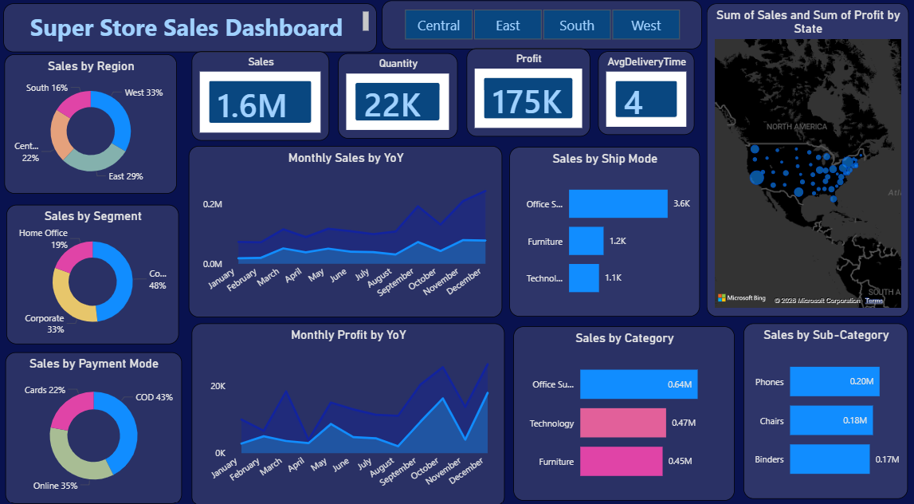

# 📊 Super Store Sales Dashboard — Power BI

An interactive **Super Store Sales Dashboard** built using **Microsoft Power BI** to analyze sales performance, profitability, quantity, delivery time, and customer/order segments.

## 📌 Project Overview

This dashboard provides a visual analysis of Super Store sales data across different regions, segments, payment modes, product categories, sub-categories, and shipping modes.

The dashboard is designed to help identify sales trends, understand regional performance, compare product categories, and monitor key business KPIs.

## 🛠️ Tools & Technologies

- **Power BI Desktop**
- **Power Query** — Data cleaning and transformation
- **DAX** — Measures and KPI calculations
- **Data Visualization** — Charts, KPI cards, maps, and slicers

## 📈 Dashboard KPIs

| KPI | Value |
|---|---:|
| **Total Sales** | 1.6M |
| **Total Quantity** | 22K |
| **Total Profit** | 175K |
| **Average Delivery Time** | 4 Days |

## 📊 Dashboard Features

### Sales Analysis

- Sales by Region
- Sales by Segment
- Sales by Payment Mode
- Sales by Product Category
- Sales by Product Sub-Category
- Sales by Ship Mode

### Trend Analysis

- Monthly Sales by Year-over-Year (YoY)
- Monthly Profit by Year-over-Year (YoY)

### Geographic Analysis

- State-level visualization of **Sales and Profit** using a map

### Interactive Filtering

The dashboard includes region-based filtering for:

- Central
- East
- South
- West

## 🔍 Key Insights

- The **West region** contributes the largest share of regional sales at approximately **33%**.
- The **Consumer segment** contributes the highest share of sales at approximately **48%**.
- **COD (Cash on Delivery)** is the largest payment mode at approximately **43%**.
- **Office Supplies** is the leading product category by sales.
- **Phones** is the highest-selling sub-category among the sub-categories displayed.
- **Standard Class** is the leading shipping mode by sales.
- Monthly sales and profit trends help identify changes in business performance throughout the year.

## 🖼️ Dashboard Preview



## 📁 Project Files

```text
Super-Store-Sales-PowerBI/
│
├── SuperStore_Sales_Dashboard.pbix
├── Dashboard.png
└── README.md

🎯 Project Objective

- The objective of this project is to demonstrate practical skills in:

- Data visualization

- Business intelligence

- Data analysis

- KPI development

- DAX

- Power Query

- Interactive dashboard design

- Business insights generation

👨‍💻 Author

Shakti Bhushan Mishra

🤝 Connect With Me

- 💼 LinkedIn: Connect with me on
- LinkedIn

- 🐙 GitHub: Shakti9798

⭐ If you find this project useful, feel free to star the repository!
